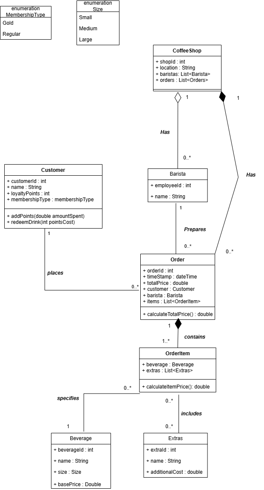
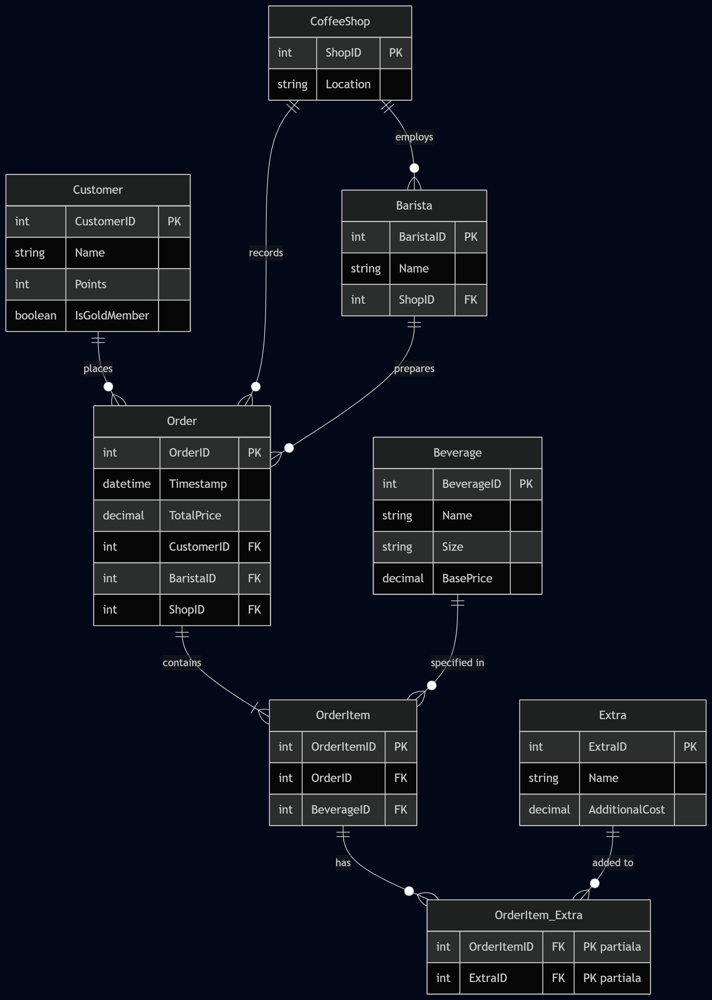
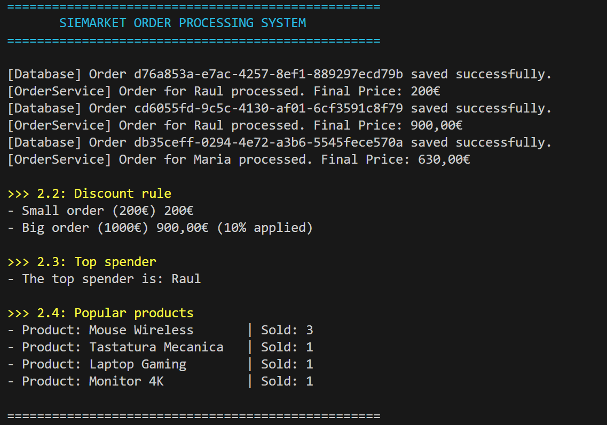

# Siemens Internship Assignment 2026

This repository contains my practical solutions for the internship selection process at Siemens.

### Problem 1: System Design and Data Modeling
**1. Class Diagram (Business Logic)**

* I treated `Beverage` and `Extra` as catalogs. Therefore, the `OrderItem` has a simple directed association to them, rather than a composition or aggregation. An order simply references an item from the menu, it doesn't "own" the definition of a Latte.
* The relationship between `CoffeeShop` and `Barista` is an aggregation. If a physical shop closes, the barista object doesn't need to be destroyed; the employee can be reassigned to a different location.
* For the loyalty points logic, I assumed a straightforward conversion where the `Customer` class handles the balance updates through `addPoints` and `redeemDrink` methods.

**2. Entity-Relationship Diagram (Database Schema)**

* I normalized the database to handle the relationships efficiently and ensure data integrity.
* To resolve the many-to-many relationship between the items ordered and the extras added (e.g., one drink can have multiple syrups, and a specific syrup can be added to multiple drinks), I introduced a junction table called `OrderItem_Extra` using a composite primary key.
* Customer membership status is stored as a simple boolean (`IsGoldMember`) rather than a string, to optimize storage and query performance.

## Problem 2: Order Processing System (C# / .NET)

For the backend implementation, I built a console application structured around Clean Architecture principles.

### Technical Details & Design Decisions:
* **Structure:** Separated the code into Domain Models, Business Logic (Services), and Data Access (Repositories) using interfaces.
* **Dependency Injection:** The `OrderService` uses interfaces (`IDiscountService`, `IOrderRepository`) instead of concrete implementations, making the code easier to test and maintain.
* **Data Types:** Used the `decimal` type for all money-related properties (prices, totals) to ensure precise financial calculations and avoid floating-point rounding errors.
* **Data Processing** Used `GroupBy`, `Sum`, and `OrderByDescending` to dynamically find the top-spending customer.
  * For the bonus requirement, used `SelectMany` to flatten the order items and aggregated them into a `Dictionary` to count the most popular products.

### Execution Output
The screenshot below shows the console output, verifying the discount logic, the top spender calculation, and the popular products list.

